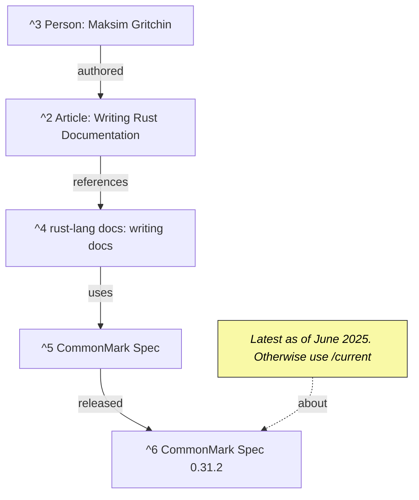

```table-of-contents
```

1. [1 Rust Parquet serialize and deserialize](#1-rust-parquet-serialize-and-deserialize)
2. [2 Objective](#2-objective)
3. [3 Instructions for LLM](#3-instructions-for-llm)
4. [4 Journal](#4-journal)
	1. [4.1 Getting the parquet_derive write example to work](#41-getting-the-parquet_derive-write-example-to-work)
		1. [4.1.1 Creating a pull request to fix the documentation](#411-creating-a-pull-request-to-fix-the-documentation)
	2. [4.2 Getting the parquet_derive read example to work](#42-getting-the-parquet_derive-read-example-to-work)
	3. [4.3 On maintainer request: looking to remove no_run](#43-on-maintainer-request-looking-to-remove-no_run)
		1. [4.3.1 What is `no_run` ? What does it mean in rust tooling?](#431-what-is-no_run--what-does-it-mean-in-rust-tooling)
		2. [4.3.2 Removing the `no_code` and testing](#432-removing-the-no_code-and-testing)
		3. [4.3.3 Changes for Commit (8d1e9963)](#433-changes-for-commit-8d1e9963)
	4. [4.4 Attempting to add feature for nested structs and enums to parquet_derive (PEND)](#44-attempting-to-add-feature-for-nested-structs-and-enums-to-parquet_derive-pend)
5. [5 Solution](#5-solution)
6. [6 References](#6-references)


# 1 Rust Parquet serialize and deserialize

2025-06-20 Wk 25 Fri - 14:09

This note relates to [[001 Turn EWRAM and ROM Structs into C Structs and embed into type for gdb memory manipulation]]. We are trying to run the lexer on the entire repository and save it as tokens and we need a good library for this and to be conservative about space and fast about reading/writing.

# 2 Objective

Produce a ready example of serializing a `Vec<T>` to a parquet file and deserializing it again. This should happen with minimum friction, using `#[derive]s` on the types. Ideally using or similar to the `serde` library.

# 3 Instructions for LLM
- This is a diagnostic document and not a conversation. Everything shared is context. Address the questions tagged (Q#) like (Q1) for example. If you see something like (~1), assume it part of the archive and not a latest set of questions.
	- Since it keeps occurring, I ask Again
	- !!! NEVER RESPOND TO (~1), (~2), etc.
	- ONLY respond to the tagged questions. Nothing else.

(LLM chatgpt-4o)
(/LLM chatgpt-4o)

# 4 Journal

I have found a [tutorial](<https://colinsblog.net/2021-07-27-reading-parquet-with-rust/>) by Colin which writes on parquet use, however it manually constructs the expected schema. I need it to be automatic based on type definitions.

Same for this [post](<https://stackoverflow.com/questions/67900928/writing-a-vec-of-rows-to-a-parquet-file>). It gives an example, but not using derive.

(~1) Find a working example of this.

- There is a [parquet_derive](<https://docs.rs/crate/parquet_derive/latest>) [[#^1]] crate.

They have a working example there. Let's try to adapt it to the same example we used in [[Wk 25 000 Rust CSV Reader Writer with Derive]]


Searching stack overflow for `parquet_derive`, I find this [post](<https://stackoverflow.com/questions/75124404/creating-datafusions-dataframe-from-vecstruct-in-rust/75125062#75125062>) which leads to an [example](<https://docs.rs/parquet_derive/30.0.1/parquet_derive/derive.ParquetRecordWriter.html>) in the [parquet_derive](<https://docs.rs/crate/parquet_derive/latest>) [[#^1]] docs


(Q1) Combine the current code with their working example. I do not want a manual schema either.

## 4.1 Getting the parquet_derive write example to work

It did not work immediately, but with some minor corrections it did. It will be in `repro001`. 

When I try to open it with visidata, I get:

```
External package "pyarrow" not installed
```

Install it:

```sh
python3 -m pip install pyarrow
```

Now we are able to open parquet files and confirm the example works as expected.

In order to run the [example](<https://github.com/LanHikari22/rs_repro/blob/main/src/repro_tracked/repro001_parquet_derive_example.rs>):

```sh
git clone https://github.com/LanHikari22/rs_repro.git
cd rs_repro
cargo run --features "repro001"
```

Then you will see `example.parquet` created in the repo root directory.

### 4.1.1 Creating a pull request to fix the documentation

2025-06-21 Wk 25 Sat - 19:41


```
To build documentation, run `cargo doc --no-deps`. To compile and view in the browser, run `cargo doc --no-deps --open`.
```

I need to fork [arrow-rs](<https://github.com/apache/arrow-rs>).

Then clone it in my system:
```sh
cd /home/lan/src/cloned/gh/LanHikari22/forked
git clone git@github.com:LanHikari22/arrow-rs.git
```

First, let's make a correction for the broken [example](<https://docs.rs/parquet_derive/30.0.1/parquet_derive/derive.ParquetRecordWriter.html>).

Note that it's version `30.0.1`, but the current is [55.1.0](<https://docs.rs/parquet_derive/latest/parquet_derive/>) as of 2025-06-21. 

But it is the same example. Here is [latest](<https://docs.rs/parquet_derive/latest/parquet_derive/derive.ParquetRecordWriter.html>).

Our target is [parquet_derive/src/lib.rs](<https://github.com/apache/arrow-rs/blob/main/parquet_derive/src/lib.rs>). Specifically the documentation for `parquet_record_writer`

Let's create a new branch for this documentation change, `docs`

```
git checkout -b update_parquet_record_writer_docs
```

Then just put the same code as in my [repro001](<https://github.com/LanHikari22/rs_repro/blob/main/src/repro_tracked/repro001_parquet_derive_example.rs>) but with more brevity.

As the README says, let's check the new documentation:
```sh
# in /home/lan/src/cloned/gh/LanHikari22/forked/arrow-rs/parquet_derive
cargo doc --no-deps --open
```

It looks good. Let's commit this and push. Going through `git log`, it seems the convention is to start with the module name first. So `parquet_derive: ...`

```sh
git commit -m "parquet_derive: update in working example for ParquetRecordWriter"
git push origin update_parquet_record_writer_docs
```

Github immediately recognizes this push and gives me the option to `Compare & pull request`

The convention is that the PR needs to close some issue. Let's open a [new issue](<https://github.com/apache/arrow-rs/issues/7732>) for [arrow-rs](<https://github.com/apache/arrow-rs>):

Github points me to the [contribution guidelines](<https://github.com/apache/arrow-rs/blob/1ededfe024e6da1dd08bd0aee9411d1fb04523ac/CONTRIBUTING.md>) for this project. Seems to have a bunch of things on testing and benchmarks which can be useful for code features.

2025-06-21 Wk 25 Sat - 20:37

PR submitted.

2025-06-21 Wk 25 Sat - 21:25

Updated the stack overflow [post](<https://stackoverflow.com/questions/67900928/writing-a-vec-of-rows-to-a-parquet-file>) as well.

2025-06-24 Wk 26 Tue - 20:54

Further work based on comments from the maintainer on this PR can be found [[#4.3 On maintainer request looking to remove --no_run|here]].

## 4.2 Getting the parquet_derive read example to work

2025-06-21 Wk 25 Sat - 20:37

Now that we can write `Vec<T>` with `T` having `parquet_derive`, let's try the read example. This will be `repro002`. 

Reading the derive source for [parquet_record_reader](<https://github.com/apache/arrow-rs/blob/1ededfe024e6da1dd08bd0aee9411d1fb04523ac/parquet_derive/src/lib.rs#L191C8-L191C29>) we can see that there are several limitations:
1. it does not support enums yet. This is also true for the writer.
2. It manually requires us to feed it the number of records in the parquet file.

That said, [repro002](<https://github.com/LanHikari22/rs_repro/blob/main/src/repro_tracked/repro002_parquet_derive_read_example.rs>) works for reading the parquet file of the same struct written before.

To run it:

```rust
git clone https://github.com/LanHikari22/rs_repro.git
cd rs_repro
cargo run --features "repro002"
```

2025-06-21 Wk 25 Sat - 21:27

Let's open a [feature request issue](<https://github.com/apache/arrow-rs/issues/7734>). Enum and struct in struct support is essential.

## 4.3 On maintainer request: looking to remove no_run

2025-06-24 Wk 26 Tue - 20:48

I previously opened [#7733](<https://github.com/apache/arrow-rs/pull/7733>) [[#4.1.1 Creating a pull request to fix the documentation|here]].

In [#7733](<https://github.com/apache/arrow-rs/pull/7733>), [alamb](https://github.com/alamb) suggested to remove no_run so that the code can be automatically checked by CI.

One way to check is if the example has wrong code, then the code would not compile. Then it would satisfy the CI requirement (continuous integration).

in `arrow-rs/parquet_derive`, the [README](<https://github.com/apache/arrow-rs/tree/main/parquet_derive#readme>) specifies

```markdown
Testing a `*_derive` crate requires an intermediate crate. Go to `parquet_derive_test` and run `cargo test` for unit tests.
```

Let's run the tests.

```sh
# in /home/lan/src/cloned/gh/LanHikari22/forked/arrow-rs/parquet_derive_test
cargo test

# stdout
running 5 tests
test tests::test_aliased_result ... ok
test tests::test_parquet_derive_read_write_combined ... ok
test tests::test_parquet_derive_read_optional_but_valid_column ... ok
test tests::test_parquet_derive_read_pruned_and_shuffled_columns ... ok
test tests::test_parquet_derive_hello ... ok

test result: ok. 5 passed; 0 failed; 0 ignored; 0 measured; 0 filtered out; finished in 0.02s
```

### 4.3.1 What is `no_run` ? What does it mean in rust tooling?

2025-06-24 Wk 26 Tue - 21:13

2025-06-26 Wk 26 Thu - 04:22

[rust-lang docs: documentation-tests](<https://doc.rust-lang.org/rustdoc/write-documentation/documentation-tests.html>) [[#^7]] mentions use of `no_run`. 

They mention:

> The `no_run` attribute will compile your code but not run it. This is important for examples such as "Here's how to retrieve a web page," which you would want to ensure compiles, but might be run in a test environment that has no network access. This attribute can also be used to demonstrate code snippets that can cause Undefined Behavior.


We have no such constraints. We want the examples to act as tests.

2025-06-26 Wk 26 Thu - 04:43

We are able to test issues in the doctests by running

```sh
cargo test --doc -- --show-output
```

For more clarity, we can also add asserts for expected behavior.

### 4.3.2 Removing the `no_code` and testing

Let's just remove `no_code` from the new example we added for `ParquetRecordWriter`

```sh
# in /home/lan/src/cloned/gh/LanHikari22/forked/arrow-rs/parquet_derive
cargo doc --no-deps --open
```

2025-06-26 Wk 26 Thu - 05:40

I rewrote the example and instead of `a_str` I use `a_string` because reading so far does not allow references... And for comprehensive testing of writing, it helps to read what we just wrote and confirm it's identical to expected.

Oops, I ended up commiting and pushing to my other feature branch

```sh
$ git commit
[add_inner_struct_and_enum_support_to_parquet_derive 8d1e9963] parquet_derive: Update ParquetRecordWriter example

$ git push origin add_inner_struct_and_enum_support_to_parquet_derive
```

Luckily I didn't do work there yet, so easy fix.

```sh
git checkout update_parquet_record_writer_docs
git merge add_inner_struct_and_enum_support_to_parquet_derive
git push origin update_parquet_record_writer_docs
```

### 4.3.3 Changes for Commit (8d1e9963)

See [Commit](<https://github.com/apache/arrow-rs/pull/7733/commits/8d1e9963a0cbd2a5732180f14fe0b3da5c0a385c>).

2025-06-26 Wk 26 Thu - 05:13

- [x] Added link to the more relevant documentation for read/write parquet

2025-06-26 Wk 26 Thu - 06:06

- [x] Added a working writing/reading test for ParquetRecordWriter

Some things to consider:
- [ ] Clarify or update README example. It is incomplete. 

## 4.4 Attempting to add feature for nested structs and enums to parquet_derive (PEND)

2025-06-21 Wk 25 Sat - 21:51

[feature request issue](<https://github.com/apache/arrow-rs/issues/7734>). 

In case I wanna give it a shot:

```rust
git checkout -b add_inner_struct_and_enum_support_to_parquet_derive
```

So what's the strategy here? Nesting can go on and on arbitrarily. We could look at how they do it with serde/json. It might give some ideas.

# 5 Solution

PEND

# 6 References
1. [parquet_derive docs](<https://docs.rs/parquet_derive/30.0.1/parquet_derive/derive.ParquetRecordWriter.html>) ^1
2. [Writing Rust Documentation by Maksim Gritchin](<https://dev.to/gritmax/writing-rust-documentation-5hn5>) ^2
3. [Maksim Gritchin: Dev Profile](<https://dev.to/gritmax>) ^3
4. [rust-lang docs: writing docs](<https://doc.rust-lang.org/rustdoc/how-to-write-documentation.html>) ^4
5. [CommonMark Spec](<https://commonmark.org/>) ^5
6. [CommonMark Spec 0.31.2](<https://spec.commonmark.org/0.31.2/>) ^6
7. [rust-lang docs: documentation-tests](<https://doc.rust-lang.org/rustdoc/write-documentation/documentation-tests.html>) ^7


