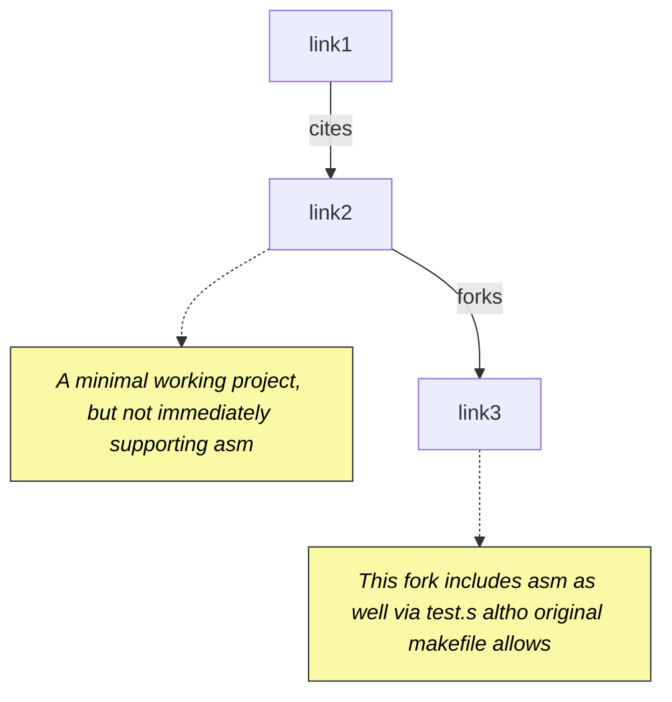

#lan #task #active #build #debugging #gdb #types
```table-of-contents
```

# 1 Objective

As mentioned in [[000 Setup project & tools and build on a new Linux machine#2.3.1 Reading/writing to memory as a struct (TODO)]], we are unable to modify memory using C type information because although we document structs they are not present in a format gdb understands.

## 2.1 Misc Notes
2025-06-13 Wk 24 Fri - 07:37

[[#^link1]] mentions that NanoBoyadvance is currently the most accurate emulator.

We should be able to clone gba-bootstrap [[#^link3]] as our toy project. The next thing is to define a struct and map it to some region in EWRAM like `0x2000000`.

Because we already setup arm-none-eabi-xxx in [[000 Setup project & tools and build on a new Linux machine#3.2 arm-none-eabi-gdb requiring libncurses.so.5]] we are able to just go to `template_c` and `make`.

let's try the game.

Right, no game loop or anything. We can see what happens when we try to debug it:

This is because in this fork, a `testfn` function was called first prior to the game loop. Commenting it out, we can see three dots in mGBA:

![[Pasted image 20250613082539.png]]

Let's check via gdb if there are currently any recognized types in this game:

No. In Makefile, add `-g` for `ASFLAGS` and `CFLAGS` and remove `-O3` for `CFLAGS`, then we find:

The first sentence under section 2.1 is: "[[#^link1]] mentions that NanoBoyadvance is currently the most accurate emulator."

The time mentioned in that section is 07:37 on Friday, June 13th, 2025 (2025-06-13 Wk 24 Fri - 07:37).

- [ ] Setup a toy gba asm project with ldscript memory mapping
- [ ] Include C ROM structs and also map them to RAM in the toy gba project and confirm memory access via arm-none-eabi-gdb
- [ ] Parse all structs from bn6f repo using bn_repo_editor
- [ ] Impl an action in bn_repo_editor to embed the final built elf with additional type information based on the parsed C structs and memory maps (for example toolkit somewhere in EWRAM should point to a C struct)
- [ ] Test that we are able to write/read to EWRAM C Structs in bn6f.elf instead of direct memory map
- [ ] Setup a script that breaks in a function, and writes to memory via a type for persistent intervention

# 2 Journal

## 2.1 Misc Notes

2025-06-13 Wk 24 Fri - 07:37

[[#^link1]] mentions that NanoBoyadvance is currently the most accurate emulator.

We should be able to clone gba-bootstrap [[#^link3]] as our toy project. The next thing is to define a struct and map it to some region in EWRAM like `0x2000000`

```sh
git clone https://github.com/davidgfnet/gba-bootstrap.git
```

Because we already setup arm-none-eabi-xxx in [[000 Setup project & tools and build on a new Linux machine#3.2 arm-none-eabi-gdb requiring libncurses.so.5]] we are able to just go to `template_c` and `make`

let's try the game

```sh
mgba first.elf
```

Right, no game loop or anything. We can see what happens when we try to debug it:
```
Program received signal SIGILL, Illegal instruction.

0x00000004 in ?? ()
```

This is because in this fork, a `testfn` function was called first prior to the game loop. Commenting it out, we can see three dots in mGBA:

![[Pasted image 20250613082539.png]]

Let's check via gdb if there are currently any recognized types in this game:

```
(gdb) info types
All defined types:
```

No. In Makefile, add `-g` for `ASFLAGS` and `CFLAGS` and remove `-O3` for `CFLAGS`, then we find:

```
All defined types:

File /home/lan/Downloads/gcc-arm-none-eabi-10.3-2021.10/arm-none-eabi/include/machine/_default_types.h:
57:     typedef unsigned short __uint16_t;

File /home/lan/Downloads/gcc-arm-none-eabi-10.3-2021.10/arm-none-eabi/include/sys/_stdint.h:
36:     typedef unsigned short uint16_t;

File source/main.c:
        char
        int
        long
        long long
        unsigned long long
        unsigned long
        short
        unsigned short
        signed char
        unsigned char
        unsigned int
```

(Attempt1) I added to main.c:

```C
typedef struct {
    uint16_t HP;
    uint16_t MP;
}MyStruct;
```

Still not recognized. 

(Attempt2) Let's make sure that the struct is used in main via a stack variable:

```C
struct MyStruct {
    uint16_t HP;
    uint16_t MP;
};

[...]

int main(int argc, char *argv[])
{
    REG_DISPCNT = DISPCNT_BG_MODE(3) | DISPCNT_BG2_ENABLE;

    struct MyStruct st = {0};
    st.HP = 400;

	[...]
}

``` 
^code1

We can find that it exists via the debug dump of readelf:

```sh
$ readelf -w  first.elf | less
[...]
DW_AT_name        : (indirect string, offset: 0x60): MyStruct
[...]
0x00000060 4d795374 72756374 00474e55 20433131 MyStruct.GNU C11
```

gdb also recognizes it now:

```
(gdb) info types
All defined types:                                                               
[...]
File source/main.c:
19:     struct MyStruct;
```

2025-06-13 Wk 24 Fri - 11:08

By adding
```C
// to main.c
struct MyStruct {
    uint16_t HP;
    uint16_t MP;
};
volatile struct MyStruct St1 __attribute__((section(".mystruct")));

// to gba_cart.ld
/* EWRAM Struct Info */
.mystruct 0x2000000 : { KEEP(*(.mystruct)) } > EWRAM
```

We are now able to get gdb to associate this address with the struct, without changing any behavior or using it in functions:

```
$ (vscode) -exec p St1

$2 = {HP = 0, MP = 0}
```

There is also in vscode autocompletion for fields of structs:
![[Pasted image 20250613111515.png]]

```
$ -exec p St1->HP

$3 = 0
```

Additionally, if a variable points to it, gdb is able to recognize what struct that symbol maps to:
```C
// Added to main:
void *x = 0x2000000;

// in vscode Variables/locals
x = 0x2000000 <St1>
```

But it will not show directly in the registers:

```C
// Added to main:
__asm__ volatile ("ldr r4, =0x2000000");

// Variables/Registers/CPU shows:
r4 = 0x2000000
```

vscode allows us to read memory, however when I tried to edit memory directly through this it did not register:
![[Pasted image 20250613111907.png]]

We can set memory directly:
```
$ -exec set {uint16_t[2]}0x2000000 = {0x03, 0x11}
=memory-changed,thread-group="i1",addr="0x02000000",len="0x4"
```

Now we can verify this reflects in the struct read:
```
$ -exec p St1

$6 = {HP = 3, MP = 17}
```

Yes! Though it would be good to specify these values in hex:

```
$ -exec p/x St1

$7 = {HP = 0x3, MP = 0x11}
```

We can also write directly via the struct:

```
$ -exec set St1->HP = 0x55

=memory-changed,thread-group="i1",addr="0x02000000",len="0x2"

$ -exec p/x St1

$8 = {HP = 0x55, MP = 0x11}
```


# 3 Retrace

# 4 References
1.  https://gbadev.net/getting-started.html#tutorials ^link1
2. https://github.com/AntonioND/gba-bootstrap ^link2
3. https://github.com/davidgfnet/gba-bootstrap ^link3



