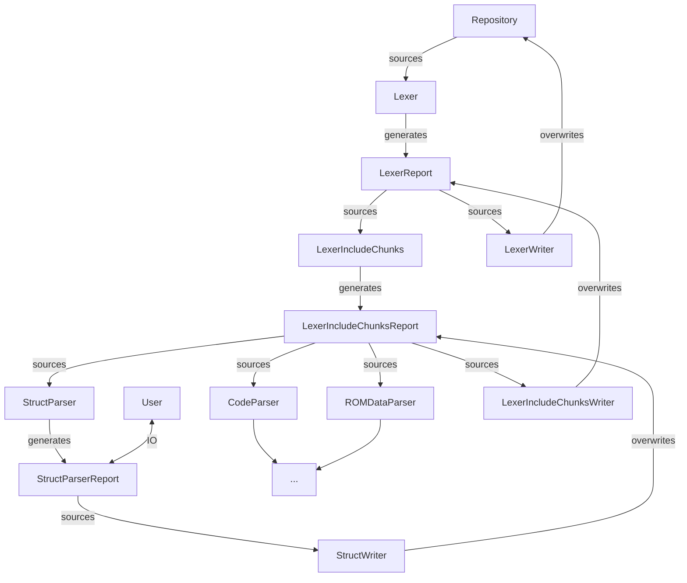
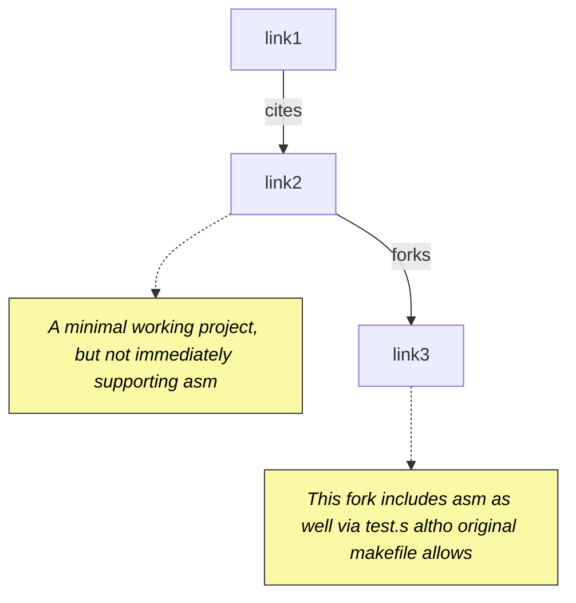

#lan #task #active #build #debugging #gdb #types
```table-of-contents
```

# 1 Objective

As mentioned in [[000 Setup project & tools and build on a new Linux machine#2.3.1 Reading/writing to memory as a struct (TODO)]], we are unable to modify memory using C type information because although we document structs they are not present in a format gdb understands.

- [x] Setup a toy gba asm project with ldscript memory mapping
- [x] Successfully map EWRAM and ROM Structs to specific regions
- [x] Investigate using these types for read/write/watch in gdb
- [x] Able to import these symbols in addition to bn6f.elf for enhanced debugging
- [ ] Parse all structs from bn6f repo using bn_repo_editor
- [ ] Create a docker container for bn_repo_editor with the ability to generate a final elf to read symbols off of for bn6f.elf
- [ ] Setup a script that breaks in a function, and writes to memory via a type for persistent intervention

# 2 Journal

## 2.1 Misc Notes

2025-06-13 Wk 24 Fri - 07:37

[[#^link1]] mentions that NanoBoyadvance is currently the most accurate emulator.

## 2.2 Setting up basic gba project for debug symbol injection

We should be able to clone gba-bootstrap [[#^link3]] as our toy project. The next thing is to define a struct and map it to some region in EWRAM like `0x2000000`

```sh
git clone https://github.com/davidgfnet/gba-bootstrap.git
```

Because we already setup arm-none-eabi-xxx in [[000 Setup project & tools and build on a new Linux machine#3.2 arm-none-eabi-gdb requiring libncurses.so.5]] we are able to just go to `template_c` and `make`

let's try the game

```sh
mgba first.elf
```

Right, no game loop or anything. We can see what happens when we try to debug it:
```
Program received signal SIGILL, Illegal instruction.

0x00000004 in ?? ()
```

This is because in this fork, a `testfn` function was called first prior to the game loop. Commenting it out, we can see three dots in mGBA:

![[Pasted image 20250613082539.png]]

## 2.3 Investigating adding debug struct types and usage

Let's check via gdb if there are currently any recognized types in this game:

```
(gdb) info types
All defined types:
```

No. In Makefile, add `-g` for `ASFLAGS` and `CFLAGS` and remove `-O3` for `CFLAGS`, then we find:

```
All defined types:

File /home/lan/Downloads/gcc-arm-none-eabi-10.3-2021.10/arm-none-eabi/include/machine/_default_types.h:
57:     typedef unsigned short __uint16_t;

File /home/lan/Downloads/gcc-arm-none-eabi-10.3-2021.10/arm-none-eabi/include/sys/_stdint.h:
36:     typedef unsigned short uint16_t;

File source/main.c:
        char
        int
        long
        long long
        unsigned long long
        unsigned long
        short
        unsigned short
        signed char
        unsigned char
        unsigned int
```

(Attempt1) I added to main.c:

```C
typedef struct {
    uint16_t HP;
    uint16_t MP;
}MyStruct;
```

Still not recognized. 

(Attempt2) Let's make sure that the struct is used in main via a stack variable:

```C
struct MyStruct {
    uint16_t HP;
    uint16_t MP;
};

[...]

int main(int argc, char *argv[])
{
    REG_DISPCNT = DISPCNT_BG_MODE(3) | DISPCNT_BG2_ENABLE;

    struct MyStruct st = {0};
    st.HP = 400;

	[...]
}

``` 
^code1

We can find that it exists via the debug dump of readelf:

```sh
$ readelf -w  first.elf | less
[...]
DW_AT_name        : (indirect string, offset: 0x60): MyStruct
[...]
0x00000060 4d795374 72756374 00474e55 20433131 MyStruct.GNU C11
```

gdb also recognizes it now:

```
(gdb) info types
All defined types:                                                               
[...]
File source/main.c:
19:     struct MyStruct;
```

2025-06-13 Wk 24 Fri - 11:08

By adding
```C
// to main.c
struct MyStruct {
    uint16_t HP;
    uint16_t MP;
};
volatile struct MyStruct St1 __attribute__((section(".mystruct")));

// to gba_cart.ld
/* EWRAM Struct Info */
.mystruct 0x2000000 : { KEEP(*(.mystruct)) } > EWRAM
```

We are now able to get gdb to associate this address with the struct, without changing any behavior or using it in functions:

```
$ (vscode) -exec p St1

$2 = {HP = 0, MP = 0}
```

There is also in vscode autocompletion for fields of structs:
![[Pasted image 20250613111515.png]]

```
$ -exec p St1->HP

$3 = 0
```

Additionally, if a variable points to it, gdb is able to recognize what struct that symbol maps to:
```C
// Added to main:
void *x = 0x2000000;

// in vscode Variables/locals
x = 0x2000000 <St1>
```

But it will not show directly in the registers:

```C
// Added to main:
__asm__ volatile ("ldr r4, =0x2000000");

// Variables/Registers/CPU shows:
r4 = 0x2000000
```

vscode allows us to read memory, however when I tried to edit memory directly through this it did not register:
![[Pasted image 20250613111907.png]]

We can set memory directly:
```
$ -exec set {uint16_t[2]}0x2000000 = {0x03, 0x11}
=memory-changed,thread-group="i1",addr="0x02000000",len="0x4"
```

Now we can verify this reflects in the struct read:
```
$ -exec p St1

$6 = {HP = 3, MP = 17}
```

Yes! Though it would be good to specify these values in hex:

```
$ -exec p/x St1

$7 = {HP = 0x3, MP = 0x11}
```

We can also write directly via the struct:

```
$ -exec set St1->HP = 0x55

=memory-changed,thread-group="i1",addr="0x02000000",len="0x2"

$ -exec p/x St1

$8 = {HP = 0x55, MP = 0x11}
```

## 2.4 Setting up workflow for debug type injection

2025-06-13 Wk 24 Fri - 12:40

We should be able to make a tool to extract all types from the repository, and inject them whether they are EWRAM or ROM structs via

```C
// in main.c
struct MyStruct {
    uint16_t HP;
    uint16_t MP;
};
volatile struct MyStruct St1 __attribute__((section(".mystruct")));

struct MyROMStruct {
    uint16_t HP;
    uint16_t MP;
};
volatile struct MyROMStruct St2 __attribute__((section(".myromstruct")));

// in gba_cart.ld

/* EWRAM Struct Info */
.mystruct 0x2000000 : { KEEP(*(.mystruct)) } > EWRAM

/* ROM Struct Info */
.myromstruct 0x8003000 : { KEEP(*(.myromstruct)) } > ROM
}
```

and once we build the elf, we can just retain the debug symbols to be included in gdb:

```
$ arm-none-eabi-objcopy --only-keep-debug first.elf firstdbg.elf
$ (gdb) add-symbol-file firstgdb.elf 0
```

To quickly load the extra symbols and also connect to remote gdb (in the terminal) you can use

```sh
arm-none-eabi-gdb bn6f.elf -ex "target remote localhost:2345" -ex "add-symbol-file firstdbg.elf 0"
```

## 2.5 Continuing impl for bn_repo_editor to parse struct info from the repo

2025-06-13 Wk 24 Fri - 14:03

To get it to build I had to install
```
sudo apt-get install libssl-dev
```

This is useful for data viewing:
```sh
python3 -m pip install visidat
```

So far we have lexical analysis done on all the asm file. This is saved in the following format (visidata UI):

![[Pasted image 20250613183553.png]]

The fields are linecol (if parsed), lexon type, and lexon data.

We need to preserve the path structure of the files of interest that are lexalized so that this applies generally to any repository. Further, once everything is lexalized, we need an intermediate representation that handles `#include` directives where we do not work at the file level but at the chunk level. Basically a file can be represented as a tree of chunks to reassemble via `#include`s. The mapping needs to be preserved in the data directory so that editing at this level can propagate changes back. 

Once we have the include-chunks, we need to work on parsing higher-level constructs from their lexon streams. There are many things to consider here. Functions, data... For the purpose of this note, our first priority is struct types. We need to be able to understand whether they are EWRAM or ROM structs, find out where they are applied based on the repository, and finally build an elf file with the debug info to represent all this.

2025-06-13 Wk 24 Fri - 19:45

```
subtractive: "tools/bn_textscript_dumper/tests/data/TextScriptBattleTutFullSynchro.s"
subtractive: "tools/bn_textscript_dumper/tests/data/TextScriptChipDescriptions0_86eb8b8.s"
subtractive: "tools/bn_textscript_dumper/tests/data/TextScriptChipTrader86C580C.s"
subtractive: "tools/bn_textscript_dumper/tests/data/TextScriptDialog87E30A0.s"
subtractive: "tools/bn_textscript_dumper/tests/data/TextScriptFolderNames86cf4ac.s"
subtractive: "tools/bn_textscript_dumper/tests/data/TextScriptWhoAmI.s"
subtractive: "tools/bn_textscript_dumper/tests/data/out/TextScriptBattleTutFullSynchro.s"
subtractive: "tools/bn_textscript_dumper/tests/data/out/TextScriptChipDescriptions0_86eb8b8.s"
subtractive: "tools/bn_textscript_dumper/tests/data/out/TextScriptChipTrader86C580C.s"
subtractive: "tools/bn_textscript_dumper/tests/data/out/TextScriptDialog87E30A0.s"
subtractive: "tools/bn_textscript_dumper/tests/data/out/TextScriptFolderNames86cf4ac.s"
subtractive: "tools/bn_textscript_dumper/tests/data/out/TextScriptWhoAmI.s"
```

It seems unexpected files are getting caught in. 
- [x] We need to add a blacklist setting for folders to not include.

### 2.5.1 Investigating slow lexer

2025-06-14 Wk 24 Sat - 06:45

```
145.86541107s Scanning "/home/lan/src/cloned/gh/dism-exe/bn6f/asm/asm31.s"
This took 1413.73046379s
1559.595904427s Writing to "/home/lan/data/apps/bn_repo_editor/lexer/asm/asm31.s"
This took 18934.689293169s
Full took 20348.422512138s
```

This is way too slow. Need to find out what the bottleneck here is. This file has 821338 tokens. Original file has 168866 lines.

2025-06-14 Wk 24 Sat - 21:04

Setup profiling according to [[#^tut1|this tutorial]] for flamegraph:

```sh
sudo apt-get install linux-tools-common linux-tools-generic
cargo install flamegraph
cargo build --release

# It's at 4, make it 1 temporarily
sudo sysctl -w kernel.perf_event_paranoid=1

CARGO_PROFILE_RELEASE_DEBUG=true cargo flamegraph --bin bn_repo_editor --  gen_debug_elf --regen

# reset back to 4
sudo sysctl -w kernel.perf_event_paranoid=4
```

2025-06-15 Wk 24 Sun - 09:10

It seems that my use of im::vector is very inefficient. But this view is also sort of hard to navigate. 

![[Pasted image 20250615090851.png]]

Let's try to use pprof. See [[#3.4.3 Pprof Rust setup to create profile.pb|instructions]].

2025-06-16 Wk 25 Mon - 08:10

For testing, we need to make it lexalize only two files:
```rust
fn app_lexer_scan_repo_files_to_dir(
	[...]
        .filter(|path| path.ends_with("asm00_0.s") || path.ends_with("asm00_1.s"))
```

```sh
$ cargo run gen_debug_elf --regen
$ sudo apt-get install graphviz
$ ~/go/bin/pprof -svg target/debug/bn_repo_editor profile.pb
```


![[Pasted image 20250616083716.png]]

We have some folds to optimize away. The graph included a [[#^docs2|link]] to documentation for how to read it.

2025-06-16 Wk 25 Mon - 09:25

- use of `Vector<T>` from the im crate for structural sharing and then doing concats on it in a loop like `&acc + &vector![item]` is slow. Replace with mutable pushs to Vec.

2025-06-16 Wk 25 Mon - 10:16

![[Pasted image 20250616101635.png]]

We still have to optimize `lexer_write_scanned_items_to_file`. This was written quickly for debugging, so it's not optimized. It rebuilds the files scanned on-the-fly to parse lineno info, which causes huge slowdowns. Still, let's try to do that hack better before we retire it completely.

- First immediate flag is immutable string concats within folds for the reconstructed file. Let's turn that into mutable edits.
- We also, as we reconstruct the file, call `get_lineno_and_col_at_index` which keeps turning the build string into lines again and again. This is unnecessary. Give it all the lines at  once, and let it use index to find the lineno and col by only searching the lines.

2025-06-16 Wk 25 Mon - 11:30

![[Pasted image 20250616113144.png]]

It seems creating file content -> lines iter is still expensive, despite that we only do it once per file now. This is over debug. We'll also try over release.

![[Pasted image 20250616114346.png]]

We get more readable and logical flows over release! It's also much faster.

![[Pasted image 20250616114556.png]]

This is our most expensive call right now. `core slice memchr memchr_aligned`

[[#^forum1-ans1|this forum answer]] has nice recommendations on using radare2 to generate a call graph png from an executable, which could be helpful in tracing problems like this.

We can look at that `get_lineno_and_col_at_index` in the assembly and source

```sh
objdump -d target/release/bn_repo_editor | less
```

### 2.5.2 Logs for improved times and actions (TODO)

2025-06-16 Wk 25 Mon - 10:59

(Debug)

| Trial (#) | asm00_0 Scan | asm00_0 Write | asm00_0 Full | asm00_1 Scan | asm00_1 Write | asm00_1 Full |
| --------- | ------------ | ------------- | ------------ | ------------ | ------------- | ------------ |
| 0         | 15.87s       | 16.14s        | 32.0s        | 43.22s       | 164.21s       | 207.43s      |
| 1         | 11.83s       | 16.64s        | 28.47s       | 37.96s       | 162.18s       | 200.13s      |
| 2         | 12.78s       | 14.78s        | 27.56s       | 37.30s       | 155.65s       | 192.95s      |
| 3         | 12.18s       | 15.89s        | 28.06s       | 41.02s       | 166.53s       | 207.55s      |

| Trial (#) | When                         | Notes                                                                                                                                                                                                  |
| --------- | ---------------------------- | ------------------------------------------------------------------------------------------------------------------------------------------------------------------------------------------------------ |
| 0         | 2025-06-16 Wk 25 Mon - 09:25 | 1.  Improvements to scan based on Vector concat usage. Used mutable variables and loops instead of folds.                                                                                              |
| 1         | 2025-06-16 Wk 25 Mon - 10:57 | 1. lineno calc reuses lines iter from whole file and not recreate it from each accumulated portion of the file.<br>2. Did not show significant improvements in asm00_1 Write.                          |
| 2         | 2025-06-16 Wk 25 Mon - 11:07 | 1. Dropped original file reconstruction. No longer used and just wastes cycles.                                                                                                                        |
| 3         | 2025-06-16 Wk 25 Mon - 11:27 | 1. Logic only checks index within range or continues. We should break if the current index is above the query index not to waste cycles scanning the whole file when it's impossible to find anything. |

(Release)

| Trial (#) | asm00_0 Scan | asm00_0 Write | asm00_0 Full | asm00_1 Scan | asm00_1 Write | asm00_1 Full |
| --------- | ------------ | ------------- | ------------ | ------------ | ------------- | ------------ |
| 0         | 1.18s        | 2.40s         | 3.58s        | 3.76s        | 30.76s        | 34.53s       |

| Trial (#) | When                         | Notes                                                                                           |
| --------- | ---------------------------- | ----------------------------------------------------------------------------------------------- |
| 0         | 2025-06-16 Wk 25 Mon - 11:40 | 1. Release has vast timing improvements over debug. But writing for asm00_1 is still very slow. |

### 2.5.3 Map current lexer project files to include chunks

2025-06-16 Wk 25 Mon - 21:46

Repository source code (asm) can `.include` files. We won't be able to parse it as a stream as-is, we need to find all the `.include`s and turn the repository into chunks. Each file can correspond to a list of chunks. So a file that maps from the files in `lexer/` to files in `lexer-include-chunks/` . The paths can be preserved, with an appended `.chunkN` 

First, we should stop getting lineno and storing this in a quick text file. We need the lexical stage to be easy and quick to serialize/deserialize. See [[001 General Assist Archive#^d895a3|csv writer/reader setup]].

2025-06-16 Wk 25 Mon - 22:57

This should make it easy to write/read from csv with quotes and multilines. Now we just need to write/read the lexer phase results themselves which are HashMap of path and LexerReport. 

2025-06-17 Wk 25 Tue - 09:49

Here is the process:


^repo-read-write-process1


2025-06-17 Wk 25 Tue - 23:54

Created a test `lexer_record_vec_read_write_are_inverses` to investigate how `write_vec_to_csv` and `read_vec_to_csv` are giving different data

```
called `Result::unwrap()` on an `Err` value: Error(Deserialize { pos: Some(Position { byte: 36, line: 2, record: 1 }), err: DeserializeError { field: None, kind: Message("unknown variant `-784054805`, expected one of `Word`, `Text`, `UInt`, `NegInt`, `UHex`, `NegHex`, `Sign`") } })
```


# 3 Issues

## 3.1 Installing visidata gives an error on run

```sh
sudo apt-get install visidata
vd
```

```
Traceback (most recent call last):
  File "/usr/bin/vd", line 6, in <module>
    visidata.main.vd_cli()
    ^^^^^^^^^^^^^^^^^^^^
AttributeError: 'function' object has no attribute 'vd_cli'
```

Try to install it through python3 instead.

```sh
sudo apt-get remove visidata
python3 -m pip install visidata
```

This works.

## 3.2 Issue building lan_rs_common

2025-06-14 Wk 24 Sat - 15:24

I need this for graph data types, graph search, logging, and parallelism with pipelines.

There's on `cargo build`:

```
   Compiling crossbeam-utils v0.8.21                                                                                                                                                          
error: failed to run custom build command for `yeslogic-fontconfig-sys v6.0.0`                                                                                                                
                                                                                                                                                                                              
Caused by:
  process didn't exit successfully: `/home/lan/src/cloned/gh/LanHikari22/lan_rs_common/target/debug/build/yeslogic-fontconfig-sys-83e88fcec271c856/build-script-build` (exit status: 101)
  --- stdout
  cargo:rerun-if-env-changed=RUST_FONTCONFIG_DLOPEN
  cargo:rerun-if-env-changed=FONTCONFIG_NO_PKG_CONFIG
  cargo:rerun-if-env-changed=PKG_CONFIG_x86_64-unknown-linux-gnu
  cargo:rerun-if-env-changed=PKG_CONFIG_x86_64_unknown_linux_gnu
  cargo:rerun-if-env-changed=HOST_PKG_CONFIG
  cargo:rerun-if-env-changed=PKG_CONFIG
  cargo:rerun-if-env-changed=FONTCONFIG_STATIC
  cargo:rerun-if-env-changed=FONTCONFIG_DYNAMIC 
  cargo:rerun-if-env-changed=PKG_CONFIG_ALL_STATIC
  cargo:rerun-if-env-changed=PKG_CONFIG_ALL_DYNAMIC
  cargo:rerun-if-env-changed=PKG_CONFIG_PATH_x86_64-unknown-linux-gnu
  cargo:rerun-if-env-changed=PKG_CONFIG_PATH_x86_64_unknown_linux_gnu
  cargo:rerun-if-env-changed=HOST_PKG_CONFIG_PATH
  cargo:rerun-if-env-changed=PKG_CONFIG_PATH
  cargo:rerun-if-env-changed=PKG_CONFIG_LIBDIR_x86_64-unknown-linux-gnu
  cargo:rerun-if-env-changed=PKG_CONFIG_LIBDIR_x86_64_unknown_linux_gnu
  cargo:rerun-if-env-changed=HOST_PKG_CONFIG_LIBDIR
  cargo:rerun-if-env-changed=PKG_CONFIG_LIBDIR
  cargo:rerun-if-env-changed=PKG_CONFIG_SYSROOT_DIR_x86_64-unknown-linux-gnu
  cargo:rerun-if-env-changed=PKG_CONFIG_SYSROOT_DIR_x86_64_unknown_linux_gnu
  cargo:rerun-if-env-changed=HOST_PKG_CONFIG_SYSROOT_DIR
  cargo:rerun-if-env-changed=PKG_CONFIG_SYSROOT_DIR

  --- stderr

  thread 'main' panicked at /home/lan/.cargo/registry/src/index.crates.io-1949cf8c6b5b557f/yeslogic-fontconfig-sys-6.0.0/build.rs:8:48:
  called `Result::unwrap()` on an `Err` value: "\npkg-config exited with status code 1\n> PKG_CONFIG_ALLOW_SYSTEM_LIBS=1 PKG_CONFIG_ALLOW_SYSTEM_CFLAGS=1 pkg-config --libs --cflags fontconfig\n\nThe system library `fontconfig` required by crate `yeslogic-fontconfig-sys` was not found.\nThe file `fontconfig.pc` needs to be installed and the PKG_CONFIG_PATH environment variable must contain its parent directory.\nThe PKG_CONFIG_PATH environment variable is not set.\n\nHINT: if you have installed the library, try setting PKG_CONFIG_PATH to the directory containing `fontconfig.pc`.\n"
  note: run with `RUST_BACKTRACE=1` environment variable to display a backtrace
warning: build failed, waiting for other jobs to finish...

```
^errorlog1

Distillied,

```
The system library `fontconfig` required by crate `yeslogic-fontconfig-sys` was not found.
```

```sh
sudo apt-get install fontconfig # probably not needed. only the dev below.
sudo apt install libfontconfig1-dev
```

## 3.3 Perf Paranoid Setting

2025-06-14 Wk 24 Sat - 21:50

```sh
$ CARGO_PROFILE_RELEASE_DEBUG=true cargo flamegraph --bin bn_repo_editor
Error:
Access to performance monitoring and observability operations is limited.
Consider adjusting /proc/sys/kernel/perf_event_paranoid setting to open
access to performance monitoring and observability operations for processes
without CAP_PERFMON, CAP_SYS_PTRACE or CAP_SYS_ADMIN Linux capability.
More information can be found at 'Perf events and tool security' document:
https://www.kernel.org/doc/html/latest/admin-guide/perf-security.html
perf_event_paranoid setting is 4:
  -1: Allow use of (almost) all events by all users
      Ignore mlock limit after perf_event_mlock_kb without CAP_IPC_LOCK
>= 0: Disallow raw and ftrace function tracepoint access
>= 1: Disallow CPU event access
>= 2: Disallow kernel profiling
To make the adjusted perf_event_paranoid setting permanent preserve it
in /etc/sysctl.conf (e.g. kernel.perf_event_paranoid = <setting>)
failed to sample program, exited with code: Some(255)

```

Currently `/proc/sys/kernel/perf_event_paranoid` is set to `4`. 

Temporarily set to 1, and reset to 4 later:

```sh
sudo sysctl -w kernel.perf_event_paranoid=1
```

## 3.4 pprof Report::write_options error

2025-06-15 Wk 24 Sun - 10:34

### 3.4.1 Issue

In trying to use pprof:

```sh
cargo add pprof

# In your code
use pprof::ProfilerGuard;

fn main() {
    let guard = ProfilerGuard::new(100).unwrap();
    
    // Your program runs here
    
    if let Ok(report) = guard.report().build() {
        let file = File::create("profile.pb").unwrap();
        let mut options = report.write_options();
        options.write_proto(&file).unwrap();
    }
}

# usage

# Run your program
cargo run --release

# Then analyze with pprof
pprof -http=localhost:8080 profile.pb
```


Based on instructions in [[#^tut1]] we encounter the following error:

```
error[E0599]: no method named `write_options` found for struct `pprof::Report` in the current scope
   --> src/main.rs:280:34
    |
280 |         let mut options = report.write_options();
    |                                  ^^^^^^^^^^^^^ method not found in `Report`


```

[[#^docs1|pprof documentation]] offers different instructions, maybe due to version changes.

For the official documentation [[#3.4.2 Pprof Rust setup to create profile.pb|code]] , some changes were necessary:

```rust
        println!("report: {}", &report);
```

Seems to give errors. Had to change it to `{:?}`

and 

```
no method named `pprof` found for struct `pprof::Report` in the current scope  
method not found in `Report`
```

Checking the features to see if there are any that bring pprof:

```sh
$ cargo install cargo-feature --locked
$ cargo feature pprof                 
   Avaliable features for `pprof`
default = ["cpp"]
_protobuf = []
cpp = ["symbolic-demangle/cpp"]
flamegraph = ["inferno"]
frame-pointer = []
framehop-unwinder = ["framehop", "memmap2", "object"]
huge-depth = []
large-depth = []
perfmaps = ["arc-swap"]
prost-codec = ["prost", "prost-derive", "prost-build", "sha2", "_protobuf"]
protobuf-codec = ["protobuf", "protobuf-codegen", "_protobuf"]
arc-swap (optional)
criterion (optional)
framehop (optional)
inferno (optional)
memmap2 (optional)
object (optional)
prost (optional)
prost-build (optional)
prost-derive (optional)
protobuf (optional)
protobuf-codegen (optional)
sha2 (optional)
```

Adding `protobuf-codec` feature fixed pprof missing in Report. Next we get

```
error[E0599]: no method named `encode` found for struct `Profile` in the current scope
   --> src/main.rs:285:21
    |
285 |             profile.encode(&mut content).unwrap();
    |                     ^^^^^^ method not found in `Profile`


```

Via [[001 General Assist Archive#1 No method pprof in Report|this diagnostic log]], we need to issue the following corrections:

Include the feature `prost-codec` only instead of protobuf:
```toml
pprof = { version = "0.15.0", features = ["prost-codec"] }
```

Then include
```rust
use pprof::protos::Message;
```

This runs, but then we also run into an issue trying to convert it to svg:

```sh
$ ~/go/bin/pprof -svg profile.pb
Main binary filename not available.
pprof: failed to execute dot. Is Graphviz installed? Error: exec: "dot": executable file not found in $PATH
```

Do this:

```sh
sudo apt-get install graphviz
```

And try again but with the executable as well this time:

```sh
~/go/bin/pprof -svg target/debug/bn_repo_editor profile.pb
```
### 3.4.2 Github issue report on broken pprof example


2025-06-16 Wk 25 Mon - 08:00

- [x] Since this was in the official documentation, we need to report this via a github issue. 

[[#^issue1|Issue]] submitted
### 3.4.3 Pprof Rust setup to create profile.pb

First, we need to enable the `prost-codec` instead of `protobuf` feature in Cargo.toml:
```toml
pprof = { version = "0.15.0", features = ["prost-codec"] }
```

Then in the code,

```rust
use pprof::protos::Message;
use std::fs::File;
use std::io::Write;

[...]

// Added in program start
let guard = pprof::ProfilerGuardBuilder::default().frequency(1000).blocklist(&["libc", "libgcc", "pthread", "vdso"]).build().unwrap();

[...]

// For output in profile.proto format:
match guard.report().build() {
    Ok(report) => {
        let mut file = File::create("profile.pb").unwrap();
        let profile = report.pprof().unwrap();

        let mut content = Vec::new();
        profile.encode(&mut content).unwrap();
        file.write_all(&content).unwrap();

        println!("report: {:?}", &report);
    }
    Err(_) => {}
};
```

In order to visualize `prof.pb`, we need [[#^link4|pprof]]. Here are the [[#3.5 pprof and Go installation|Installation instructions]].

## 3.5 pprof and Go installation

To install [[#^link4|pprof]]:

- Get Go. https://go.dev/dl/

(As of this time...)
```sh
wget https://go.dev/dl/go1.24.4.linux-amd64.tar.gz
```

Then install
```sh
sudo rm -rf /usr/local/go
sudo tar -C /usr/local -xzf go1.24.4.linux-amd64.tar.gz

# Save to settings
export PATH=$PATH:/usr/local/go/bin
export GOPATH=$HOME/go
export PATH=$PATH:$GOPATH/bin
```

Then get pprof:
```sh
go install github.com/google/pprof@latest
```


# 4 References
1.  https://gbadev.net/getting-started.html#tutorials ^link1
2. https://github.com/AntonioND/gba-bootstrap ^link2
3. https://github.com/davidgfnet/gba-bootstrap ^link3
4. https://markaicode.com/profiling-applications-2025/ ^tut1
5. https://docs.rs/crate/pprof/latest ^docs1
6.  https://github.com/google/pprof ^link4
7. https://github.com/tikv/pprof-rs/issues/273 ^issue1
8. https://git.io/JfYMW ^docs2
9. https://reverseengineering.stackexchange.com/questions/16081/how-to-generate-the-call-graph-of-a-binary-file ^forum1
10. https://reverseengineering.stackexchange.com/a/16082 ^forum1-ans1
11. https://book.rada.re/ ^docs3



